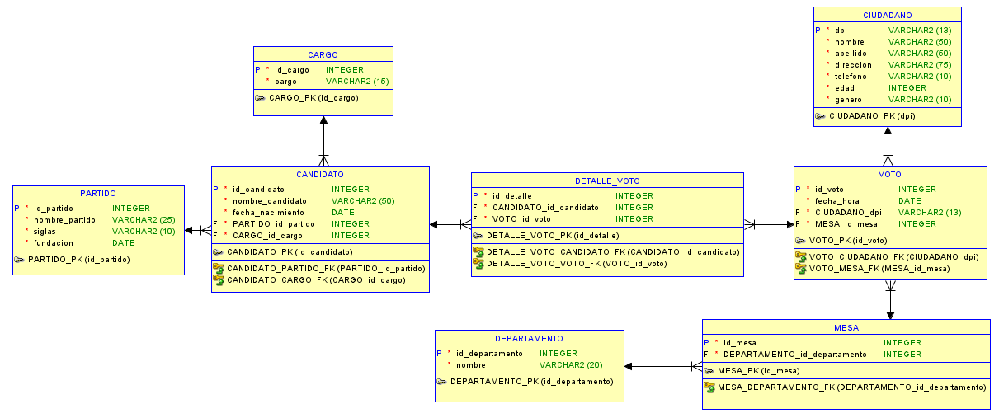

# Manual Técnico

#### ***SDB 1***
___

## INDICE
  - [**RESPONSABLES**](#responsables)
  - [**SOBRE EL PROGRAMA**](#sobre-el-programa)
  - [**ESPECIFICACIONES TECNICAS**](#especificaciones-tecnicas)
  - [**CONOCIMIENTOS PREVIOS**](#conocimientos-previos)
  - [**MODELO FISICO**](#modelo-fisico)
  - [**CODIGO**](#codigo)

  
___
## RESPONSABLES

|No.| Nombre |
|:-:| ------ | 
|1| Saúl Jafet Menchú Recinos |


___
## SOBRE EL PROGRAMA
El programa tiene como objetivo la lectura y analisis de archivos en formato JSON y Statpy los cuales pasarán por un analisis lexico y sintactico. Al terminar de ser analizados generarán codigo en Python y también gráficas de barras y pie con los datos extraídos de los archivos JSON.
___
## ESPECIFICACIONES TECNICAS
Se debe cumplir con los siguientes requisitos antes de usar el programa.

- **Sistema operativo:** windows 8, 8.1, 10 u 11.
- **Editor de codigo:** VSCode o cualquier otro editor.
- **Navegador:**  Cualquier navegador o programa para el consuma de una API.

___
## CONOCIMIENTOS PREVIOS
Los conocimientos mínimos que deben tener las personas que operarán el programa y deberán utilizar este manual son:

- Conociemientos del lenguaje SQL.
- Conocimientos de lectura archivos.
- Procesamiento de datos por medio de archivos.

___
## **MODELO FISICO**

A continuación se detalla el modelo físico realizado para la base de datos.



### Tablas
- **ciudadano:**

    Esta tabla almacena información sobre los ciudadanos. La columna dpi se utiliza como llave primaria para identificar de manera única a cada ciudadano.

- **departamento:**

    Esta tabla almacena información sobre los departamentos. Su llave primiria es el id_departamento.

- **mesa:**

    Esta tabla almacena información sobre las mesas de votación, que están relacionadas con los departamentos. La columna id_mesa es la llave primaria. La columna id_departamento se utiliza como llave foránea.

- **voto:**

    Esta tabla almacena información sobre los votos emitidos y su llave primaria es el id_voto. Las columnas dpi_ciudadano e id_mesa se utilizan como llaves foráneas.
    
- **cargo:**

    Esta tabla almacena información sobre los cargos. El id_cargo se utiliza como llave primaria.

- **partido:**

    Esta tabla almacena información sobre los partidos políticos. La columna id_partido como llave primaria.

- **candidato:**

    Esta tabla almacena información sobre los candidatos políticos. La columna id_candidato se utiliza como llave primaria. id_partido e id_cargo se utilizan como llaves foráneas.

- **detalle_voto:**

    Esta tabla almacena información detallada sobre los votos emitidos por los ciudadanos. El id_detalle se utiliza como llave primaria. Las columnas id_candidato e id_voto se utilizan como llaves foráneas.

### Relaciones
- ##### ciudadano --- voto:

    La tabla ciudadano está relacionada con la tabla voto mediante la columna dpi de ciudadano y la columna dpi_ciudadano de prueba.voto. Esto permite vincular a cada voto con el ciudadano que lo emitió.

- ##### mesa --- departamento:

    La tabla mesa está relacionada con la tabla departamento mediante el id_departamento. Esto permite asociar cada mesa de votación a un departamento específico.
    
- #####  voto --- mesa:

    La tabla voto está relacionada con la tabla mesa mediante la columna id_mesa. Esto permite vincular cada voto a la mesa de votación en la que se emitió.

- ##### candidato --- partido:

    La tabla candidato está relacionada con la tabla partido mediante el id_partido. Esto permite asociar cada candidato a un partido político.

- ##### candidato --- cargo:

    La tabla candidato está relacionada con la tabla cargo mediante el id_cargo. Esto permite vincular cada candidato al cargo político al que está aspirando.

- ##### detalle_voto --- candidato:

    La tabla detalle_voto está relacionada con la tabla candidato mediante el id_candidato. Esto permite vincular cada detalle de voto con el candidato por el que se emitió el voto.

- ##### detalle_voto --- voto:

    La tabla detalle_voto está relacionada con la tabla voto mediante el id_voto. Esto permite vincular cada detalle de voto con el voto específico que se emitió.

___
## **CODIGO**

A continuación se detallarán las funciones más importantes para el funcionamiento del programa.

El programa se compone de tres carpetas principales:

- controllers
- db
- routes
    

> Nota: Fuera de estas tres carpetas encontramos dos archivo app.js e index.js el cual nos sirve para correr la api.

Dentro de nuesta carpeta controllers archivos para ejecutar los srcipts SQL. En cada archivo se dentra una variable que contine la consulta a realizar por medio de la conexion a la base datos

```JS
exports.eliminar = async (req, res) => {
    const scriptEliminar=`
    DROP DATABASE IF EXISTS prueba;
    DROP TABLE IF EXISTS prueba.ciudadano;
    DROP TABLE IF EXISTS prueba.voto;
    DROP TABLE IF EXISTS prueba.mesa;
    DROP TABLE IF EXISTS prueba.dapartamento;
    DROP TABLE IF EXISTS prueba.detalle_voto;
    DROP TABLE IF EXISTS prueba.candidato;
    DROP TABLE IF EXISTS prueba.cargo;
    DROP TABLE IF EXISTS prueba.parrtido;`;
```

Continuando se encuentra la lectura del script en que se eliman comentarios y se realiza un split para obtener cada consulta en una lista y en un for se realiza cada consulta
```JS
    try {
        const scriptWithoutComments = scriptEliminar.replace(/(--.*)/g, '');
        const sqlCommands = scriptWithoutComments.split(";").map(command => command.trim());
        for (let i = 0; i < sqlCommands.length; i++) {
            sql = sqlCommands[i];
            if (sql.length === 0) {continue;}
            await db.query(sql,[]);
        }
```

Por último se devulve una respuesta de las consultas realizadas o un error si fuera el caso
```JS
        res.status(200).json({
            consulta: 'Eliminar tablas y modelo de BBDD', message: 'SE HA ELIMINADO EL MODELO EXITOSAMENTE' },
        );
    } catch (error) {
        res.status(500).json({
            body: { res: false, message: 'OCURRIÓ UN PROBLEMA AL ELIMINAR LA BBDD', error }, });
    }
}
```

Este mismo procedimiento se realiza para para archivo de cada consulta, de creación y de carga de datos variando unicamente en la variable script en cada archivo por lo misma razon que son para distintas consultas.

Ejemplo de la consulta 1:
```JS
exports.consulta1 = async (req, res) => {
    const scriptConsulta=`
    SELECT presi.nombre_candidato AS "Presidente",
        vice.nombre_candidato AS "Vicepresidente",
        par.nombre_partido AS "Partido"
    FROM prueba.candidato AS presi
    JOIN prueba.candidato AS vice ON presi.id_partido = vice.id_partido
    JOIN prueba.partido AS par ON presi.id_partido = par.id_partido
    WHERE presi.id_cargo = 1 AND vice.id_cargo = 2;
    `;
```
Como se puede observar la variación está en la consulta a realizar.

Continuando con el archivo se mantiene el mismo proceso anteriormente mencionado
```JS
    try {
        const msg = await db.query(scriptConsulta,[]);
        res.status(200).json({
            consulta: 'Candidatos a presidentes y vicepresidentes por partido', message: msg, });
    } catch (error) {
        res.status(500).json({
            body: { res: false, message: 'Ocurrió UN error al realizar la consulta', error }, });
    }
}
```

La única variación de este procese se encuentra en la creación de las tablas temporales. Exactamento al finalizar todas la consulta de la creación de las tablas temporales ya que se necesita de la lectura de un archivo CSV.
```JS
const datosCargos = fs.readFileSync(filePath,'UTF-8');
    const lineas = datosCargos.split('\n');
    for (let i = 0; i < lineas.length; i++) {
        if (i===0) {
            continue;
        }
        const fields = lineas[i].split(',');
        
        if (fields.length!=2) {
            console.log(fields.length)
            continue;
        }
        const id_cargo = fields[0];
        const nombre_cargo = fields[1];
```

Al terminar la lectura de cada linea se almacena en una variable o distintas dependiendo de las columnas de la tabla. Luego se procede a guardar estos datos en la tabla temporal.

```JS        
        await db.querywithoutclose(connection, `INSERT INTO prueba.cargo_temporal (id_cargo, cargo) VALUES (?, ?)`, [id_cargo, nombre_cargo]);
    }
```
> nota: estas consultas realizadas están dentro de un for.


Al terminar todas las insercciónes se procede a realizar la carga de datos de las tablas temporales a las tablas del modelo anteriormente realizado y creado.

```JS
const datosTempCargos = await db.querywithoutclose(connection, `SELECT * FROM prueba.cargo_temporal`, []);
        console.log(datosTempCargos);
        
await db.querywithoutclose(connection, `INSERT INTO prueba.cargo (id_cargo, cargo) SELECT id_cargo, cargo FROM prueba.cargo_temporal`, []);
```
Una vez terminado este proceso se procede a cerrar la conexión y automaticamente las tablas temporales se eliminan
```JS
await connection.end();
```

> Nota: Este proceso se realiza por cada tabla menos una ya a partir de una tabla temporal se realiza dos insercciones a las tablas del modelo.